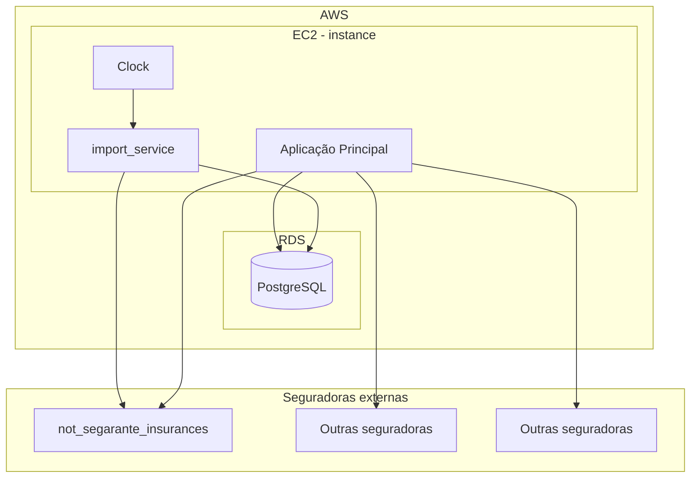

# Desafio 4 — Importador de Apólices

API Rails que simula a integração com uma seguradora fictícia, importa apólices e endossos para um banco Postgres, e streama os logs da importação em tempo real para uma tela web.

## Arquitetura (fictícia)



## Pré-requisitos

- Docker + Docker Compose

## Como rodar

Dentro do diretório `backend/desafio4`:

```bash
docker compose up -d
```

Depois abra **http://localhost:3030/**.

Para parar:

```bash
docker compose down
```

## O que a tela faz

A página tem duas colunas.

**Esquerda — Formulários**

- **Gerar apólices**: cria um lote de apólices fictícias (origens e endossos) e salva como fixtures locais.
- **Importar apólices**: escolhe um *policy holder* no dropdown e dispara a importação dos dados dele para o banco.

**Direita — Terminal**

Conecta-se via WebSocket e mostra, linha a linha em tempo real, os logs gerados durante a importação.
