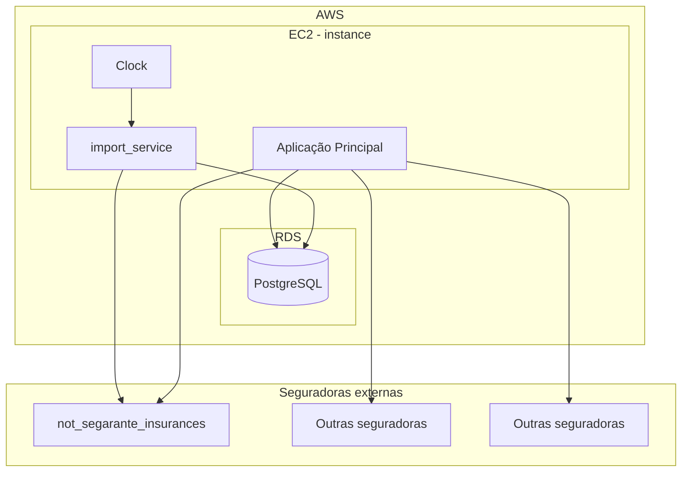

# Desafio 4 — Importador de Apólices

API Rails que simula a integração com uma seguradora fictícia, importa apólices e endossos para um banco Postgres, e streama os logs da importação em tempo real para uma tela web.

## Arquitetura (fictícia)



---

## Objetivo do desafio

**Entender os problemas atuais de arquitetura e implementação, e propor um plano de como resolvê-los para suportar os próximos passos da evolução.**

O foco **não** é corrigir pequenos bugs no código existente — é pensar na arquitetura: identificar o que está limitando hoje e desenhar como evoluí-la para atender os novos requisitos descritos abaixo.

---

## Antes de começar

1. Clonar o projeto
2. Subir o Docker
3. Acessar a aplicação no navegador
4. Iniciar a simulação

O projeto implementa, ao mesmo tempo, **o cenário de importação (o problema)** e **uma simulação desse cenário**, junto com outras partes da aplicação rodando simultaneamente. Quando você roda no navegador, ele simula o cenário de importação acontecendo **concorrente com o resto da aplicação**.

### Pré-requisitos

- Docker + Docker Compose

### Como rodar

Dentro do diretório `backend/desafio4`:

```bash
docker compose up -d
```

Depois abra **http://localhost:3030/**.

Para parar:

```bash
docker compose down
```

### O que a tela faz

A página tem duas colunas.

**Esquerda — Formulários**

- **Gerar apólices**: cria um lote de apólices fictícias (origens e endossos) e salva como fixtures locais.
- **Importar apólices**: escolhe um *policy holder* no dropdown e dispara a importação dos dados dele para o banco.

**Direita — Terminal**

Conecta-se via WebSocket e mostra, linha a linha em tempo real, os logs gerados durante a importação.

---

## Cenário atual

- A importação roda em **um worker**.
- Durante a importação, **a aplicação principal fica lenta**. (No teste isso está simplificado, mas na vida real a importação/criação de uma apólice envolve criar dezenas de objetos e arquivos, além de chamadas externas.)
- A importação acontece para **um único cliente em uma única seguradora** — até aqui isso era suficiente para o MVP da importação.
- As seguradoras têm nos mandado **dados sujos**: a IS (importância segurada) está correta, mas os demais dados de **valor e tipo da apólice não são confiáveis**.

---

## Evolução desejada

O que precisa ser suportado daqui pra frente:

1. **Integração com mais 10 seguradoras.**
2. **Multi-tenant** — suportar múltiplos `policy_holders` simultaneamente.
3. **Validação de valores** seguindo regras de negócio: se algum valor estiver inconsistente, **não importar**.

---

## Glossário

| Termo | Definição |
|---|---|
| **Policy holder** | O cliente, dono da apólice. |
| **LMG** (Limite Máximo da Garantia) | A soma dos valores de todos os endossos. |
| **Insured amount** (Importância Segurada / IS) | O valor que a apólice/endosso está modificando no seguro. |
| **Endorsement** (Endosso) | Uma alteração feita em cima do estado atual do seguro. Uma apólice pode ter vários endossos; o estado atual é sempre o último, como uma pilha. |
